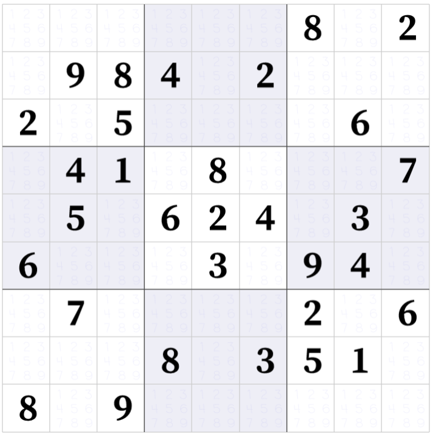
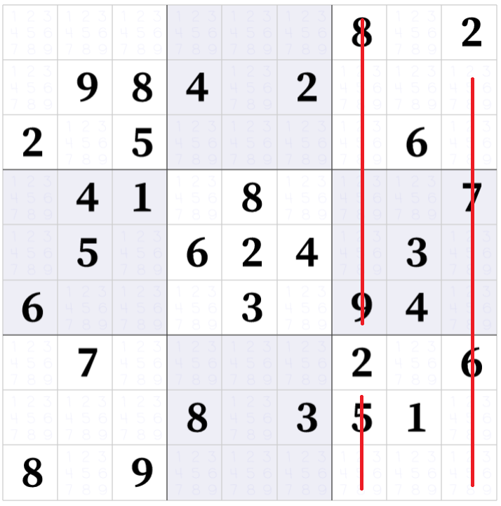
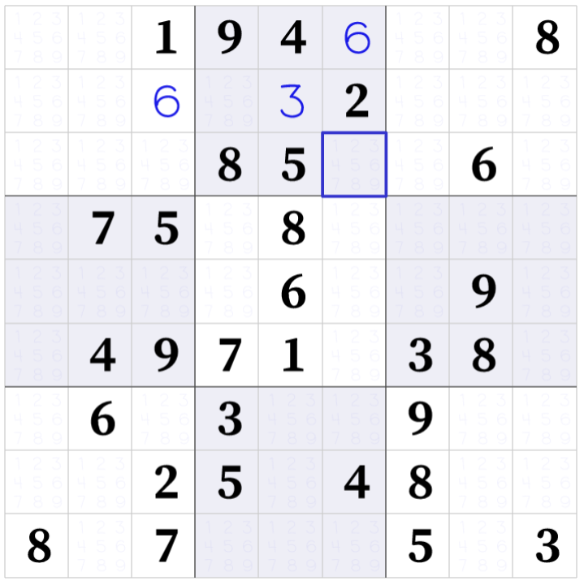

# Cvičenie 2: Vyriešenie sudoku

Sudoku je logická hra, ktorá sa skladá z mriežky *9x9* s číslami od 1 po 9. Cieľom hry je doplniť chýbajúce čísla na základe troch základných pravidiel:

1.	každý riadok môže obsahovať každé číslo iba raz;
2.	každý stĺpec môže obsahovať každé číslo iba raz;
3.	mriežka je rozdelená do podoblastí *3x3*, ktoré môžu obsahovať každé číslo iba raz.

Na začiatku mriežka obsahuje čísla tak, aby pre mriežku existovalo iba jedno riešenie. Ľudia riešia sudoku hry pomocou logických indukcií, napr. pre:



číslo 2 sa môže v pravej strednej podoblasti nachádzať iba v jednom políčku:



Takéto implikácie sa dajú ale iba ťažko naprogramovať vzhľadom na to, že niekedy vyžadujú úvahu niekoľko krokov dopredu. Pre počítače je viac vhodné riešenie pomocou *brute force* algoritmu, v ktorom počítač rekurzívne vyskúša všetky možnosti, až kým nenájde riešenie alebo nenarazí na porušenie niektorého pravidla, v tomto prípade vráti všetky zmeny a začne ďalšie kolo rekurzívnych testov.

Napríklad, v nižšie uvedenom príklade zo strednej hornej oblasti chýbajú dve čísla: 1 a 7. Algoritmus môže do modrého štvorca zapísať číslo 1, čo je validná možnosť, ale v ďalšom kroku spôsobí porušenie pravidla (dve 7 v jednom stĺpci). Preto algoritmus musí vymazať 1 a skúšať druhú možnosť, t. j. 7 a takto nájde správne riešenie pre podoblasť.



Na dnešnom cvičení naprogramujeme podobné riešenie, pričom si precvičíme základné kroky pri algoritmizácii a návrhu riešenia, ako aj základné konštrukty vetvenia a iterácií.

Úloha bude zadaná vo forme stringu s 81 znakmi, všetky sú čísla od 0 po 9, pričom 0 predstavuje prázdne políčko. Pred začatím implementácie navrhnite riešenie pre nasledovné metódy:

* `LoadSudoku` - metóda dostane ako parameter reťazec reprezentujúci úlohu sudoku a vráti vnútornú reprezentáciu ako dvojrozmerné pole znakov;
* `PrintSudoku` - metóda vypíše na obrazovku mriežku;
* `IsValid` - funkcia má parametre `grid` (reprezentuje mriežku), `row` a `col` (koordináty istej bunky) a `value` (číslo, ktoré chceme zapísať na danú pozíciu), a vráti hodnotu `true` ak číslo `value` vieme zapísať na pozíciu `[row][col]`, v opačnom prípade vráti `false`;
* `SolveSudoku` - hlavná metóda, ktorá ako parameter dostane dvojrozmerné pole znakov - reprezentáciu úlohy, úlohu vyrieši a vráti hodnotu `true` ak je úloha vyriešená, a `false` ak bolo porušené niektoré pravidlo;
* `FillSure` - metóda by mala na začiatku riešenia vyplniť čo najviac istých buniek, teda bunky, na ktoré môžeme zapísať iba jedno číslo, je na vás, akú logiku v tejto metóde implementujete.

[Predpripravené riešenie nájdete tu.](lab02/Lab02.zip)

## 1. krok: `LoadSudoku`

Implementuje metódu `LoadSudoku`, ktorá má jediný parameter, reprezentáciu mriežky pomocou stringu, kde prázdne bunky sú reprezentované 0. Napríklad vyššie uvedený príklad bez hráčom vyplnených čísel môže byť reprezentovaný nasledovne:

`001940008000002000000850060075080000000060090049710380060300900002504800807000503`

Ďalšie príklady pre testovanie nájdete v súbore [`sudokus.txt`](lab02/sudokus.txt).

Metóda `LoadSudoku` vracia jednu hodnotu, mriežku reprezentovanú ako dvojrozmerné pole znakov *9x9*. Na reprezentáciu prázdnej bunky môžete použiť ľubovoľný znak.

## 2. krok: `PrintSudoku`

Implementujte metódu `PrintSudoku`, ktorá ako parameter dostane dvojrozmerné pole znakov, ktoré vypíše do konzoly ako mriežku. Je na vás, aký výpis si zadefinujete, môžete sa inšpirovať príkladom nižšie. Metóda nemá návratovú hodnotu.

```
----------------------
| 6 3 2| . . 5| 4 . .|
| . . 4| . . 1| 3 . .|
| . . .| . . .| 5 6 7|
----------------------
| . . .| 2 7 3| . . 5|
| . 2 1| 4 . 6| . 8 .|
| . . .| 5 1 .| . . .|
----------------------
| . 6 .| . 3 .| 9 . .|
| . 4 8| . 5 .| . . 2|
| 1 . .| . 2 9| 8 . .|
----------------------
```

## 3. krok: `IsValid`

Implementujte metódu `IsValid`, ktorá má štyri parametre: `grid` (reprezentuje mriežku), `row`, `col`, a `value`. Funkcia vracia `true` ak do mriežky `grid` je možné na pozíciu `[row][col]` zapísať číslo `value` a `false` naopak. Hodnota `value` je číslo (reprezentované ako znak) od 1 po 9, `row` a `col` sú z intervalu 0 až 8.

## 4. krok: `SolveSudoku`

Implementujte metódu `SolveSudoku`, ktorá má jeden parameter – dvojrozmerné pole znakov, teda mriežku, ktorú je potrebné vyriešiť. Funkcia postupne prechádza touto mriežkou a spôsobom pokus-omyl sa snaži na voľné pozície zapísať čísla až dovtedy, kým nenarazí na porušenie pravidla. Ak sa niektoré pravidlo poruší, metóda vráti posledné zmeny a vyskúša ďalšie číslo na danej pozícii. Metóda takto postupuje ďalej až kým nevyrieši úlohu. Pri implementácii budeme predpokladať, že mriežka sa dá vyriešiť.

Vo funkcii `Main` nájdete príklad a postupné volania metód na výpis a vyriešenie úlohy. Vaše riešenie môžete otestovať na tomto príklade, alebo na ľubovoľnej úlohe zo súboru [`sudoku.txt`](lab02/sudokus.txt). Riešenie ukážkového príkladu môže vyzerať nasledovne:

```
----------------------
| 6 3 2| 7 8 5| 4 1 9|
| 7 5 4| 9 6 1| 3 2 8|
| 8 1 9| 3 4 2| 5 6 7|
----------------------
| 4 8 6| 2 7 3| 1 9 5|
| 5 2 1| 4 9 6| 7 8 3|
| 3 9 7| 5 1 8| 2 4 6|
----------------------
| 2 6 5| 8 3 4| 9 7 1|
| 9 4 8| 1 5 7| 6 3 2|
| 1 7 3| 6 2 9| 8 5 4|
----------------------
```

## Doplňujúca úloha: `FillSure`

Implementujte metódu `FillSure`, ktorá má jeden parameter – reprezentáciu mriežky pomocou dvojrozmerného poľa. Funkcia napodobňuje spôsob ktorým ľudia riešia úlohy sudoku, t. j. hľadá políčka, do ktorých je možné zapísať iba jedno číslo, alebo také riadky, stĺpce alebo podoblasti, v ktorých niektoré číslo je možné zapísať iba do jedného políčka. Funkcia do mriežky doplní takéto hodnoty a slúži pre zjednodušenie úlohy pred rekurzívnym vyhľadávaním, takže zavolajte ju vo funkcii `Main` po načítaní mriežky.

Je na vás, aké implikácie funkcia obsahuje, musí ale obsahovať aspoň jednu implikáciu.
