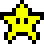

# Cvičenie 3: Prvé kroky vo vývoji hry

Od dnešného cvičenia sa budeme zaoberať vývojom jednoduchej hry, pri ktorom budeme využívať softvérový rámec *MonoGame*. Ak ho ešte nemáte nainštalovaný, postupujte podľa [tohto návodu](https://docs.monogame.net/articles/getting_started/0_getting_started.html). Následne skúste vytvoriť nový prázdny projekt, v ktorom budeme postupne implementovať našu hru.

## 1. krok: Štruktúra projektu

Ak ste postupovali správne a podarilo sa vám spojazdniť *MonoGame*, vytvorí sa vám projekt, v ktorom sa nachádza hneď niekoľko pre nás zaujímavých súborov.

Hlavný súbor, ktorý slúži na spustenie hry, sa nazýva `Program.cs`, a obsahuje iba niekoľko riadkov kódu, napríklad:

```
using var game = new MyGame.Game1();
game.Run();
```

V kóde sa najprv vytvorí objekt `game`, reprezentujúci celú hru, a následne sa zavolá metóda na spustenie hry `Run()`. Samotná definícia triedy hry sa nachádza v súbore `Game1.cs`. Ten definuje triedu `Game1`, ktorá dedí od triedy `Game` (zápis `Game1 : Game`). Môžete si všimnúť, že hneď na začiatku súboru máte niekoľko importov z frameworku *XNA*. Dôvodom je, že samotný *MonoGame* je nadstavba frameworku *XNA*, ktorý umožňuje spúšťať hry.

Trieda definuje dve členské premenné:

* `GraphicsDeviceManager _graphics` - zodpovedná za grafiku hry;
* `SpriteBatch _spriteBatch` - zodpovedná za vykresľovanie objektov na obrazovku. V 2D grafike sa často používajú takzvané *sprity* pre grafickú reprezentáciu objektov, a zjednodušujú tak vývoj hry. Ako stále, ľavý horný roh obrázkov predstavuje bod `[0, 0]`.

Trieda tiež obsahuje niekoľko metód, ako:

* `Initialize()` - zodpovedná za funkcionalitu pri spustení hry.
* `LoadContent()` - zodpovedná na načítanie zdrojových a pomocných súborov, teda všetkých externých zdrojov, ktoré naša hra bude využívať. Tieto súbory sa budú nachádzať v priečinku `Content`, ktorý je tiež súčasťou projektu.
* `Update(GameTime gameTime)` - zodpovedná za aktualizáciu herného stavu medzi dvomi vykresleniami. Parameter `gameTime` poskytuje informáciu o čase v rámci hry.
* `Draw(GameTime gameTime)` - rieši vykresľovanie hernej scény.

Po tom, čo sme sa oboznámili so štruktúrou projektu, môžeme sa pustiť do pridávania prvých objektov.

## 2. krok: Pridávanie súborov do projektu

Na to, aby sme mohli vykresľovať všetko, čo chceme, potrebujeme najprv pridať obrázky do nášho projektu. To všetko nám umožňuje súbor `Content.mgcb`. Je to špeciálny typ súboru, ktorý sa dá editovať ako textový súbor, alebo cez *MGCB Editor*. Ak používate Visual Studio, tak editor môžete spustiť dvojklikom na súbor v *Solution Explorer*.

Prvým objektom, ktorý vykreslíme, bude [jednoduchý sprite hviezdy, stiahnite si teda `.png` súbor](lab03/star.png).



V *MGCB Editor* kliknite na *Add Existing Item*, a vyberte si súbor hviezdy. Pri pridávaní vyberte možnosť *Copy the file to the directory*. Následne projekt uložte v editore.

**Poznámka:** Ak sa vám nepodarilo otvoriť *MGCB Editor*, tak nakopírujte obrázok `star.png` do priečinku `Content`, a súbor `Content.mgcb` otvorte ako textový súbor a po riadku *Content* pridajte nasledovné riadky:

```
#begin star.png
/importer:TextureImporter
/processor:TextureProcessor
/processorParam:ColorKeyColor=255,0,255,255
/processorParam:ColorKeyEnabled=True
/processorParam:GenerateMipmaps=False
/processorParam:PremultiplyAlpha=True
/processorParam:ResizeToPowerOfTwo=False
/processorParam:MakeSquare=False
/processorParam:TextureFormat=Color
/build:star.png
```

## 3. krok We're stars

Hviezda je už súčasťou nášho projektu, avšak na to, aby sme ju vykreslili, musíme ju pridať aj do nášho kódu. Vykresľovanie sa uskutoční na základe textúr, práve preto pridajte novú privátnu členskú premennú typu `Texture2D` do triedy `Game1`:

```
private Texture2D star;
```

Samozrejme k tomu, aby sme hviezdu uvideli v hernom okne, musíme si súbor načítať a následne vykresliť.

Nezabudnite, že načítavanie všetkých súborov by sa mal vykonávať v metóde `LoadContent()`, upravte teda túto metódu tak, že po *TODO* pridáte načítanie nášho obrázka:

```
star = Content.Load<Texture2D>("star");
```

`Content` je vnútorný property triedy, ktorý zabezpečuje načítavanie objektov napríklad cez metódu `Load()`, ktorú voláme. Čudné zobáčiky upresňujú typ návratovej hodnoty (je to tá istá trieda `Texture2D`, ktorá definovala typ premennej `star`), a vrátime sa k nim pri generickom programovaní. Do tradičných zátvoriek pridáme len názov súboru s obrázkom, ktorý chceme vykresliť (bez prípony).

Ako sme už spomínali, samotné vykresľovanie vyriešime cez použitie `SpriteBatch` objektu, pridajte teda do metódy `Draw()` nasledovné riadky:

```
_spriteBatch.Begin();
_spriteBatch.Draw(star, new Vector2(100, 100), Color.White);
_spriteBatch.End();
```

`SpriteBatch` umožňuje vykresľovanie niekoľkých spritov naraz bez toho, aby sme to museli robiť po jednom, čo poskytne lepší výkon. Zavolaním metódy `Begin()` dáme vedieť, že niečo vôbec ideme vykresľovať. Následne prichádza vykresľovanie, ktoré ukončíme zavolaním metódy `End()`.

Volanie metódy `Draw()` môže na prvý pohľad vyzerať komplikovane, takže pozrime sa na to, čo znamenajú jednotlivé parametre:

* `star` - textúra (sprite), ktorú chceme vykresliť;
* `new Vector2(100, 100)` - pozícia, na ktorú chceme objekt vykresliť, dá sa definovať rôznymi spôsobmi, vektorová reprezentácia nám zatiaľ stačí;
* `Color.White` - posledný parameter určuje, či chceme obrázok zatieniť nejakou farbou. Keďže my to tentokrát urobiť nechceme, necháme biely overlay, čo reálne nezmení nič na našom obrázku.

**Pohrajte sa s pozíciou a tienením spritu, a otestujte, ako ovplyvňujú výstup.**

## 4. krok: There's a bomb

V ďalšom kroku pridáme do nášho projektu bombu, ktorú budeme mať za úlohu včas deaktivovať. [Najprv si pridajte do projektu obrázok `bomb.png` tak, ako ste to robili s hviezdou.](lab03/bomb.png)


Ako môžete vidieť, bomba sa líši od reprezentácie hviezdy. Je to z toho dôvodu, že objekt nebude vizualizovaný ako statický obraz, ale ako animácia. Renderovanie animácie je však výpočtovo náročný proces, a práve preto namiesto toho sa často zadefinuje niekoľko snímok pre jeden sprite v jednom súbore, a tieto snímky (alebo *frame*) sa vykresľujú jedna po druhej - tzv. *texture atlas*, alebo *spritesheet*.

### 4.1. krok: Vlastná trieda

Aby sme nemali všetko v jednom súbore, vytvoríme si vlastnú triedu pre reprezentáciu bomby. Pridajte do projektu nový priečinok `Actors`, v ktorom vytvorte súbor `Bomb.cs`

V triede zadefinujte niekoľko členských premenných. Jedna slúži pre načítanú textúry (podobne ako pri hviezde), a celočíselné hodnoty v sebe uchovávajú užitočné hodnoty:

* `texture` - textúra, teda načítaný `.png` súbor;
* `rows` - počet riadkov snímok v zdrojovom súbore;
* `columns` - počet stĺpcov snímok v zdrojovom súbore;
* `width` - šírka jednej snímky;
* `height` - výška jednej snímky;
* `currentFrame` - povie nám, ktorú snímku momentálne chceme vykresliť;
* `totalFrames` - celkový počet snímok.

Pridajte do triedy konštruktor s jedným parametrom `ContentManager content`, ktorý:

1. načíta textúru pomocou parametra `content` (postupujte ako pri hviezde);
2. nastaví hodnotu premenných `rows`, `columns`, `width`, `height` a `totalFrames`. Hodnotu `currentFrame` môžete, ale nemusíte inicializovať.

### 4.2. krok: Nakreslíme bombu

V ďalšom kroku musíme implementovať metódu `Draw(SpriteBatch spriteBatch, Vector2 location)` v triede `Bomb`, ktorá definuje spôsob vykresľovania bomby do okna. Prvý parameter je `SpriteBatch`, ktorý je zodpovedný za vykresľovanie všetkých spritov, a druhý parameter `Vector2` udáva pozíciu vykreslenej bomby.

Do metódy pridajte nasledovné riadky:

```
public void Draw(SpriteBatch spriteBatch, Vector2 location)
{
    int row = currentFrame / columns;
    int col = currentFrame % columns;

    Rectangle sourceRectangle = new Rectangle(width * col, height * row, width, height);
    Rectangle destinationRectangle = new Rectangle((int)location.X, (int)location.Y, width, height);

    // TODO: draw bomb using spriteBatch
}
```

Na úvod potrebujeme vypočítať riadok a stĺpec aktuálnej snímky (rovnaký princíp ako minulý týždeň pri riešení sudoku). Následne definujeme dva obdĺžniky. Prvý definuje priestor, ktorý potrebujeme načítať z `.png` súboru spritu, kde prvé dva parametre udávajú ľavý horný roh obdĺžnika, a ďalšie dva parametre jeho šírku a výšku. Druhý obdĺžnik určuje pozíciu vykreslenia do okna (rovnaké parametre).

**Do metódy pridajte samotné vykresľovanie bomby na obrazovku podobne, ako sme to robili pre hviezdu.** [Využite pri tom implementáciu metódy `Draw()` so štyrmi parametrami.](https://docs.monogame.net/api/Microsoft.Xna.Framework.Graphics.SpriteBatch.html#Microsoft_Xna_Framework_Graphics_SpriteBatch_Draw_Microsoft_Xna_Framework_Graphics_Texture2D_Microsoft_Xna_Framework_Rectangle_System_Nullable_Microsoft_Xna_Framework_Rectangle__Microsoft_Xna_Framework_Color_)

### 4.3. krok: Ty ju vidíš?

Samozrejme aby sa nám bomba zobrazila v hernom okne, musíme ju pridať do hry. Upravte teda triedu `Game1` nasledovne:

1. pridajte členskú premennú typu `Bomb`;
2. v metóde `LoadContent()` vytvorte nový objekt typu `Bomb` a uložte ho do príslušnej členskej premennej;
3. v metóde `Draw()` bombu vykreslite na ľubovoľnú pozíciu.

Ak sa vám bomba zobrazí, skúste ju posunúť tak, aby sa prekrývali s hviezdou. Ako vyzerá výsledok? Čo ovplyvňuje vykresľovanie týchto dvoch spritov?

## 5. krok: It's a ticking bomb!

Bombu sme chceli reprezentovať animáciou, zatiaľ však vidíme iba statický obraz. Dôvodom je, že vždy vykresľujeme tú istú snímku zo *spritesheetu*, keďže hodnotu `currentFrame` nikdy nemeníme. Nato, aby sme videli meniaci sa obrázok, potrebujeme túto skutočnosť napraviť.

### 5.1. krok: Časovanie

Najjednoduchším spôsobom vytvorenia animácie je zmena aktuálnej snímky na základe uplynutého času. Aby sme to mohli sledovať, potrebujeme pomocné premenné, ktoré budú určovať frekvenciu zmeny, a čas uplynutý od poslednej zmeny animácie. Zadefinujte preto v triede `Bomb` dve členské premenné:

* `float timer` - uchováva čas do ďalšej zmeny snímky;
* `const float TIMER` - konštanta reprezentujúca frekvenciu zmeny snímky (po koľkých sekundách zmeníme animáciu?), nastavte na ľubovoľnú hodnotu.

Hodnotu `timer` nastavte v konštruktore triedy.

### 5.2. krok: Aktualizácia

Všetky aktualizácie stavu herných objektov by sa mali odohrávať v metóde `Update()`, pridajte ju teda do triedy `Bomb`:

```
public void Update(GameTime gameTime)
{

}
```

`GameTime` objekt v sebe uchováva informáciu o hernom čase. Do metódy pridajte nasledovnú funkcionalitu:

1. získajte čas uplynutý od posledného volania metódy `Update()`, dostanete ho z `gameTime` cez `gameTime.ElapsedGameTime.TotalSeconds`
2. uplynutý čas odčítajte od `timer`
3. ak čas už uplynul (`timer` má zápornú hodnotu), aktualizujte premennú `currentFrame`. Nezabudnite tiež nastaviť znova premennú `timer`, a ustrážte aj to, aby hodnota `currentFrame` nepresahovala celkový počet framov v animácii (ideme od *0* po *počet - 1*).

### 5.3. krok: Prepojenie s hrou

Neostáva nám nič iné, len našu implementáciu zavolať z obdobnej metódy v `Game1`. Ak ste postupovali správne, na obrazovke uvidíte blikajúcu bombu.

**Skúste zmeniť frekvenciu blikania cez nastavenie konštanty `TIMER`.**

## Doplňujúca úloha

Zatiaľ naša bomba bliká v pravidelných intervaloch. Skúste riešenie upraviť tak, aby čas medzi dvomi bliknutiami sa postupne skracoval.
