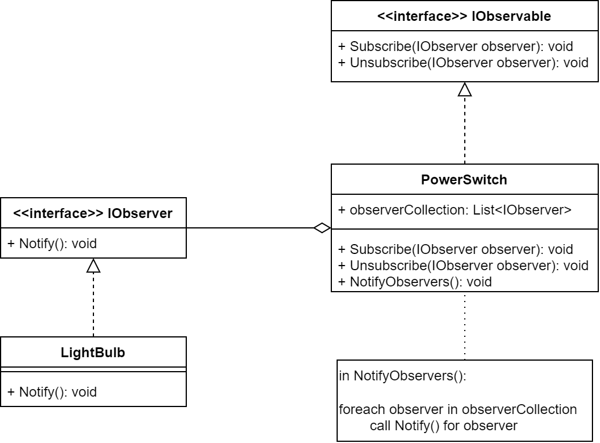

# Cvičenie 4: Prepojenie aktérov a návrhový vzor Observer

Na minulom cvičení sme do našej hry pridali jediný objekt, na dnešnom cvičení si do hry pridáme ďalšie, a tie aj prepojíme. Aj keď objekty dokážeme priamo prepojiť cez členské premnné (tzv. asociácia), my si ukážeme iný prístup, ktorý stavia na výhody paradigmy OOP. Konkrétne ide o návrhový vzor *Observer*, ktorý je prvým zo sady návrhových vzorov, ktoré budeme preberať a implementovať na cvičeniach.

Keď chceme sledovať zmenu hodnoty, vieme stále dopytovať na aktuálnu hodnotu a porovnať ju s lokálnou kópiou predošlej hodnoty. Takýto prístup je síce funkčný, pri väčšom počte dopytov (ak od danej hodnoty je závislých väčší počet ďalších hodnôt) však využívame veľkú časť výpočtovej kapacity čisto na kladenie zbytočných otázok. Bolo by teda vhodnejšie náš prístup otočiť: namiesto toho, aby sme sa pýtali na prípadnú zmenu hodnoty, budeme aktívne informovať o tejto zmene iba v momente, keď k nej dôjde. Podobný prístup poznáte zo života pri odbere noviniek, resp. notifikácií. V OOP toto riešenie umožňuje práve použitie vzora *Observer*, ktorého diagram vidíte nižšie, [podrobnejšie informácie nájdete napríklad na Wikipedii](https://en.wikipedia.org/wiki/Observer_pattern).



## 1. krok: Let There Be Light

Pred tým než sa spustíme do samotnej implementácie návrhového vzoru, potrebujeme si pridať do nášho projektu nové objekty. [Resource súbory k novým animáciám sú dostupné tu.](lab04/resources04.zip) Nové súbory rozbaľte do priečinka `resources` do projektu, a nezabudnite tiež nastaviť kopírovanie súborov. [Podrobnejší popis k animáciám nájdete v predošlom cvičení (kroky 2 a 4.1)](https://github.com/ianmagyar/pvjc/blob/master/labs/lab03.md). Pri implementácii tried sa môžete inšpirovať triedou `Bomb`.

**Poznámka:** Všetky triedy a rozhrania pridajte do priečinku (balíka) `Actors`.

### 1.1. `LightBulb`

Vytvorte triedu `LightBulb`, ktorá bude reprezentovať žiarovku. Na prvý pohľad sa môže zdať, že ide o ďalšiu animáciu ako v prípade bomby, avšak v porovnaní s blikaním sa pohľady na žiarovku (zapnutá vs. vypnutá) nebudú až tak často meniť. Práve preto si načítame dve možné textúry, a budeme si medzi nimi vyberať na základe stavu žiarovky. V konštruktore si teda pripravte dve textúry: `bulb_on.png`, `bulb_off.png`. Takisto umožnite umiestnenie spritu do hry na istú pozíciu na základe parametrov konštruktora.

Pridajte do triedy metódu `Toggle()` a implementujte ju nasledovne:

* nech sa pri jej zavolaní zmení stav žiarovky medzi zapnutým a vypnutým - stav objektu bude popísaný stavom žiarovky: zapnutá a vypnutá (na začiatku bude žiarovka vypnutá);
* pri zmene stavu zmeňte animáciu.

### 1.2. `PowerSwitch`

Vytvorte triedu `PowerSwitch`, ktorá predstavuje vypínač. Trieda je veľmi podobná žiarovke, pridajte teda dve animácie `switch_on.png` a `switch_off.png`.

Znovu definujte metódu `Toggle()` s prakticky rovnakou implementáciou ako v prípade `LightBulb`.

### 1.3. Spoločné rozhranie

Ako môžete vidieť, máme dve (zatiaľ) skoro rovnaké triedy, ktoré sa líšia iba v názve a animáciách - princíp DRY (*Don't Repeat Yourself*) nám hovorí, že by sme tieto veci mali dať do spoločnej triedy - C# však neumožňuje dediť z viacerých tried súčasne. Náš problém by sme mohli vyriešiť vytvorením triedy, ktorá by slúžila ako medzikrok v hierarchii: nová trieda by implementovala spoločnú funkcionalitu `Toggle` s vnútornou reprezentáciou; následne by triedy `LightBulb` a `PowerSwitch` dedili od novej triedy. Toto by nám ale skomplikovalo hierarchiu tried, ktorú neskôr rozšírime, a práve preto vytvoríme iba spoločné rozhranie, ktoré bude deklarovať spoločnú funkcionalitu, ktorú ale budú implementovať aj naďalej jednotlivé triedy.

**Poznámka:** Nové verzie C# prišli s tzv. default interface methods - rozhranie môže za určitých podmienok implementovať funkcionalitu metódy, túto možnosť ale nebudeme využívať, keďže je to netypické pre OO jazyky a best practice hovorí o veľmi špecifickom využití tohto rozšírenia.

Vytvorte si rozhranie `ISwitchable` deklarajúce spoločné metódy:

```
public interface ISwitchable
{
    void Toggle();
    void TurnOn();
    void TurnOff();
    bool IsOn();
}
```

Nech obidve triedy implementujú toto rozhranie, syntax je nasledovná. Potrebujete implementovať dodatočné metódy `TurnOn()`, `TurnOff()` a `IsOn()`, pričom môžete využiť už implementované riešenia.

```
public LightBulb : ISwitchable
{
    //magic happens here
```

Funkcionalitu otestujte vytvorením žiarovky a vypínača, umiestnite ich do sveta a zmeňte ich stav pred spustením hry.

## 2. krok: I See You

Ďalej budeme pokračovať implementáciou návrhového vzoru *Observer*, ku ktorému budeme potrebovať dve ďalšie rozhrania:

```
public interface IObserver
{
    void Notify();
}

```

```
public interface IObservable 
{
    void Subscribe(IObserver observer);

    void Unsubscribe(IObserver observer);
}

```

Vaše riešenie upravte nasledovne:

* nech `LightBulb` implementuje `IObserver`;
* `PowerSwitch` nech implementuje `IObservable`;
* v `PowerSwitch` si udržiavajte referenciu na žiarovku - keď sa zmení stav `PowerSwitch`, dajte o tom žiarovke vedieť. Ako typ referencie využite rozhranie `IObserver`, a na notifikáciu príslušnú metódu.

Funkcionalitu viete otestovať úpravou kódu vo funkcii `Main()`: zaregistrujte žiarovku ako odberateľa vypínača, a na začiatku programu zapnite iba vypínač. Žiarovka sa zapne automaticky.

## 3. krok: My Command Is Your Wish

Písať kód, ale nič nevidieť nie je veľmi praktické, a aby sme nemuseli testovanie riešiť surovým kódom, pridáme trošku interaktivity do nášho riešenia. Konkrétne sa jedná o prácu so vstupom z klávesnice, ktorú máte implementovanú vo frameworku. Zadefinujte metódu `Update()` triedy `PowerSwitch` tak, že pridáte do nej podmienku:

```
if (Keyboard.GetState().IsKeyDown(Keys.E))
```

Ak táto podmienka platí, zavolajte `Toggle()`. Po úspešnej implementácii môžete po spustení hry vypínač vypínať a zapínať stlačením klávesu *E*. Pre fungovanie si musíte naimportovať modul `Microsoft.Xna.Framework.Input` do triedy.

Pri podržaní klávesu *E* však môžete vidieť, ako hra stále aktualizuje jednotlivé animácie, keďže *MonoGame* nedeteguje jednorázové stlačenie, ale stláčanie klávesu. Ak chcete eliminovať toto správanie, tak postupujte nasledovne:

1. pridajte do projektu utility triedu `KeyChecker` s obsahom

```
public class KeyChecker
{
    static KeyboardState currentKeyState;
    static KeyboardState previousKeyState;

    public static KeyboardState GetState()
    {
        previousKeyState = currentKeyState;
        currentKeyState = Microsoft.Xna.Framework.Input.Keyboard.GetState();
        return currentKeyState;
    }

    public static bool IsPressed(Keys key)
    {
        return currentKeyState.IsKeyDown(key);
    }

    public static bool HasBeenPressed(Keys key)
    {
        return currentKeyState.IsKeyDown(key) && !previousKeyState.IsKeyDown(key);
    }
}
```

2. upravte podmienku v `PowerSwitch.Update` na `KeyChecker.HasBeenPressed(Keys.E)` (nezabudnite tiež na import)
3. do `Game1.Update` pridajte príkaz `KeyChecker.GetState();`

## 4. krok: Power! Unlimited Power!

Momentálne dokážeme napájať na vypínač iba jednu žiarovku, čo je síce super, ale ak v hre chceme mať dlhé chodby, nechceli by sme mať pre každú žiarovku osobitný vypínač. V C ste pre udržiavanie niekoľkých hodnôt rovnakého typu používali polia (*array*). Má ich aj C# ale oveľa praktickejšie je použiť triedu, ktorá nám funkcionalitu polí zaobaľuje. C# má takýchto tried celú sadu a sú implementované v mennom priestore `System.Collections`. Dnes budeme používať `List<T>`, teda zoznam, do ktorého vieme dynamicky pridávať a odstrániť prvky.

V popise triedy `T` predstavuje tzv. typový parameter - používa sa, keď vopred nevieme, akého typu bude parameter na vstupe, ale už potrebujeme implementovať funkcionalitu. V tomto prípade vieme, že chceme mať zoznam, avšak nevieme, akého typu budú jednotlivé prvky, no funkcionalita zoznamu bude rovnaká bez ohľadu na konkrétny typ. Typový parameter doplníme pri vytváraní konkrétneho zoznamu, ako môžete vidieť na príkladoch nižšie:

```
List<int> list; //list of integer values
List<LightBulb> lightBulbs; //list of objects of type LightBulb
...
List<string> listOfStrings = new List<string>(); //create a new instance
...
```

Upravte `PowerSwitch` tak, aby bolo možné pridávať a odoberať observerov - pre zoznam observerov používajte triedu `List`:

* na pridanie použite `List.Add(T value)`;
* na odobratie môžete použiť `List.Remove(T value)` - pred tým si ale skontrolujte, či daný prvok už v zozname je (aby sme predišli chybám). Ako na to, pozrite si dostupné metódy pomocou dopĺňania kódu (`Ctrl + Space`) alebo v dokumentácii.
* v rámci `TurnOn()` / `TurnOff()` resp. `Toggle()` upozornite všetky observer žiarovky o zmene stavu vypínača.

Pri aktualizácii môžete využívať iteráciu `foreach`:

```
foreach (type val in listOfTypes)
{
    // do something with val
}
```
