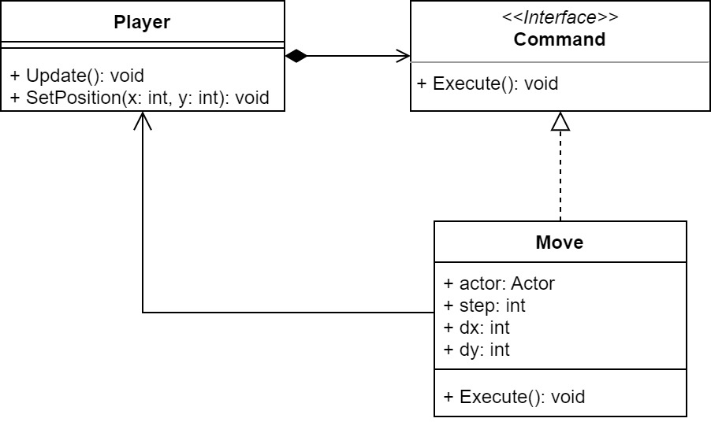

# Cvičenie 5: Projekt narastá

Na dnešnom cvičení budeme ďalej rozvíjať našu hierarchiu tried, pričom si precvičíme dedičnosť, abstraktné triedy a ukážeme si ďalší návrhový vzor - *Command*. Ako už samotný názov naznačuje, návrhový vzor zabezpečuje spracovanie príkazov, ktoré zadajú naši používatelia, a aby interakcia bola intuitívna, pozrieme sa na to, ako dokážeme pracovať s používateľským vstupom.

Pre ďalšiu prácu budete potrebovať mať implementované minimálne triedy `PowerSwitch` a `LightBulb` a ich rozhrania z minulého cvičenia. [Ak vlastný projekt nemáte po ruke, môžete pracovať s týmto projektom.](lab05/game_l04.zip)

## 1. krok: Observer pt. II

Na minulom cvičení sme už zadefinovali jednoduchú formu návrhového vzoru *Observer*, ktorá však mala zásadnú chybu: observer objekty nedokázali zistiť, v akom stave sa nachádzal nimi pozorovaný objekt. V ukážkových prípadoch to problém nerobil, keďže doteraz sme rátali s tým, že každý objekt vytvoríme vo vypnutom stave a prepojíme ich ešte pred spustením hry. Následne sme zabezpečili prepnutie stavu observerov pri zmene stavu pozorovaného objektu. Čo sa však stane, ak vypnutú žiarovku budeme chcieť napojiť na zapnutý vypínač počas behu programu? Budeme musieť zosynchronizovať ich stavy.

Túto funkcionalitu vieme vyriešiť niekoľkými spôsobmi. Na dnešnom cvičení si ukážeme jednoduché riešenia, kde spolu s notifikáciou príde aj informácia o pozorovanom objekte. Naša implementácia bude čiastočne redundantná, avšak slúži najmä ako ukážka možných riešení takéhoto problému.

### 1.1. Rozšírenie konštruktora
Pridajte do konštruktora `LightBulb` referenciu na `PowerSwitch`, ku ktorému bude pripojený. Následne z konštruktora viete priamo dať subscribe na tento objekt, ako aj získať aktuálny stav vypínača. Takéto riešenie by však umožnilo vytvorenie iba žiaroviek, ktoré sú už pripojené na vypínač. Preto ošetrite prípad, že konštruktor dostane `null` referenciu, a pridajte aj metódu, ktorá umožní pridať zdroj až po spustení programu.

### 1.2. Úprava rozhrania
Ďalšia možnosť je rozšíriť metódu `Notify` definovanú rozhraním `IObserver` o parameter, ktorý bude obsahovať referenciu na pozorovaný objekt. Cez túto referenciu môžete potom získať aktuálny stav pozorovaného objektu. Upravte najprv deklaráciu metódy v rozhraní `IObserver`:

```
void Notify(IObservable observable)
```

Následne upravte definíciu metódy v triede `LightBulb` a volanie v triede `PowerSwitch` tak, aby ste mohli získať informáciu o stave vypínača (či je zapnutý alebo vypnutý). Pri implementácii narazíte na problém nekompatibility jednotlivých rozhraní triedy `PowerSwitch`, ktorý viete vyriešiť [pretypovaním](https://learn.microsoft.com/en-us/dotnet/csharp/programming-guide/types/casting-and-type-conversions) alebo použitím [kľúčového slova `as`](https://learn.microsoft.com/en-us/dotnet/csharp/language-reference/operators/type-testing-and-cast#as-operator).

## 2. krok: Abstraktné triedy

Naposledy sme si vytvorili triedy `LightBulb` a `PowerSwitch`, ktoré mali časť funkcionality rovnakú, dnes sa pozrieme na to, ako by sme mohli túto časť dať dokopy.

Vytvorte si abstraktnú triedu `AbstractSwitchable`, ktorá nech implementuje `ISwitchable`. Trieda bude definovať spoločnú funkcionalitu tried `LightBulb` a `PowerSwitch`, teda konkrétne metódy `Toggle()`, `IsOn()`, `TurnOn()` a `TurnOff()`.

Z `LightBulb` presuňte definíciu metód `Toggle()`, `IsOn()`, `TurnOn()` a `TurnOff()` do `AbstractSwitchable` a nastavte dedenie medzi triedami (samozrejme tieto metódy vymažte aj z `PowerSwitch`). Teoreticky by ste mohli do abstraktnej triedy pridať aj metódu `Draw()`, tú ale budeme riešiť na ďalšom cvičení.

Pri prepisovaní metód C# neumožňuje prekrývať ľubovoľné metódy, iba tie, ktoré sú na to označené - keyword `virtual` alebo `abstract`. V prípade potreby doplňte slovíčko do deklarácie metód.

**Poznámka:** Pri niektorých metódach v nadtriede nechceme, aby metóda bola volaná mimo triedy, teda mohli by sme im priradiť prístup `private`. Ak však chceme, aby metóda bola prekrytá podtriedami, musíme ju označiť minimálne ako `protected` (dostupné iba v rámci triedy a jej potomkov).

## 3. krok: Nadtrieda a podtrieda

Vytvorte si triedu `CrackedLightBulb`, bude sa jednať o žiarovku, ktorá je poškodená, a dá sa rozsvietiť iba niekoľkokrát. Ako predka (rodiča) zoberte `LightBulb`.

Pre zabezpečenie potrebnej funkcionality prekryte metódu `TurnOn()` (nezabudnite upraviť deklaráciu aby obsahovala `virtual`) tak, aby sa žiarovka dala zapnúť iba toľkokrát ako je to povolené. Keby hráč chcel takúto žiarovku zapnúť ešte raz, nič sa nestane. 

Prekrytím metódy je schovaný pôvodný kód, ale nie je úplne stratený: pomocou kľúčového slova `base` sa k nemu vieme dostať, napríklad:

```
base.TurnOn();
```

Samozrejme pre ukladanie počtu možných zapnutí potrebujete novú členskú premennú (typu `int`), zadefinujte ju teda a pridajte aj nový konštruktor. V konštruktore využite kód, ktorý ste už implementovali v `LightBulb`. Konštruktory je možné vzájomne volať pomocou `this` (v rámci jednej triedy) a `base` pre konštruktor nadtriedy:

```
public class DerivedClass : BaseClass
{
    public DerivedClass() : base()
    {
        //magic happens here
    }
    public DerivedClass(string s) : base()
    {
        //some more magic happens here
    }

    public DerivedClass(int x) : this()
    {
        //and magic again
    }
}
```

**Poznámka:** Nezabudnite funkcionalitu upraviť tak, aby využívala volanie `TurnOn()` ak ste tak ešte neurobili.

## 4. krok: Cometh forth Mine Own Apprentice

Nadišiel čas, aby sme do našej hry pridali hlavnú postavu.

Vytvorte si triedu `Player`, ako animáciu zatiaľ použite [`player.png`](lab05/player.png). Hlavnou vlastnosťou hráča bude pohyb v hernom svete v rôznych smeroch, pre hráča však nezadefinujeme viac animácií. V prípade, že sa hráč otočí, animáciu otočíme. To síce pridá výpočtovú záťaž do našej hry, tá by ale mala byť zvládnuteľná pre naše počítače. Ak sa naša postavička hýbať nebude, zastavíme aktualizáciu spritov, zatiaľ však túto funkcionalitu nemusíte implementovať.

Do triedy okrem podpory animácie pridajte aj podporu pre interné ukladávanie aktuálnej pozície hráča ako aj pre aktualizáciu týchto údajov (metóda `UpdatePosition()` podľa diagramu nižšie). Inšpirovať sa môžete triedami `Bomb` a `LightBulb`. Opakujúci sa kód budeme riešiť na ďalšom cvičení.

## 5. krok: Didst thee Forget How to Moveth?

Ale ako sa hýbať?

Najjednoduchšie by bolo priamo do `Update()` implementovať čítanie klávesnice a upravovať takto pozíciu. Takéto riešenie je však nepraktické a zbytočne by skomplikovalo inak jednoduchú metódu. [Namiesto toho teda využijeme návrhový vzor *Command*, ktorý vynašli od nás múdrejší návrhári na riešenie presne takýchto problémov.](https://en.wikipedia.org/wiki/Command_pattern)



Zadefinujte interface `IMovable` (nech sa nachádza v namespaci `Actors`). Toto rozhranie v sebe nebude mať žiadnu funkcionalitu, jedná sa o tzv. *marker interface* - slúži len na odlíšenie tried. Nech `Player` implementuje rozhranie `IMovable`.

Vytvorte si priečinok `Commands` a pridajte do neho rozhranie `ICommand` s metódou `Execute()`:

```
public interface ICommand
{
    void Execute();
}
```

Jedná sa o základ návrhového vzoru, ktorý teraz postupne implementujeme.

### 5.1. `Move`

Do priečinku `Commands` pridajte triedu `Move` (implementuje `ICommand`).

Nech je konštruktor deklarovaný nasledovne: `public Move(IMovable movable, int step, int dx, int dy)`, kde `step` udáva rýchlosť pohybu a `dx` a `dy` udávajú smer pohybu pohybujúceho sa actora `movable`.

*Svet používa klasické indexovanie súradníc ako v poli, kde ľavý horný roh má [0,0], x-ová súradnica je vodorovná a rastie doprava, y-ová je zvislá a rastie smerom dole.*

**Poznámka:** V konštruktori nezabudnite vykonať typovú kontrolu, či ste dostali objekt, ktorý je aj `Player`. Ak by to neplatilo, program nesmie pokračovať - vyvolajte chybu (s vhodnou chybovou hláškou). Chybu v C# viete vygenerovať pomocou kľúčového slova [`throw`](https://learn.microsoft.com/en-us/dotnet/csharp/language-reference/keywords/throw):

```
throw new ArgumentException("error message goes here");
```

Ak chybu nikde v kóde neošetríme, spôsobí to, že program spadne - nadnes je to náš cieľ.

V `Execute()` zabezpečte zmenu pozície `IMovable` actora - využite metódu `UpdatePosition()` z triedy `Player`, objekt musíte najprv pretypovať.

### 5.2. `Player`

V triede `Player` si na vhodnom mieste (asi konštruktor) inicializujte pomocné objekty potrebné pre pohyb. Vytvorte osobitný objekt pre všetky štyri základné smery. Zabezpečte, aby sa v metóde `Update()` vykonalo čítanie z klávesnice a zodpovedajúci pohyb vykonajte pomocou návrhového vzoru *Command*. Využite teda novú triedu `Move`.

*Čítanie z klávesnice je dostupné cez triedu `KeyChecker`. Príklad použitia ste mali na minulom cvičení. Okrem `HasBeenPressed()` je dostupná aj metóda `IsPressed()`, vyskúšajte si ich, aký je medzi nimi rozdiel? Ktorá je vhodnejšia pre riešenie pohybu?*

*Klávesy sú vymenované v enumerácii `Microsoft.Xna.Framework.Input.Keys`, zatiaľ sú pre nás zaujímavé `Keys.Up / Down / Left / Right` - tieto mapujú šípky.*

V návrhovom vzore *Command* je každý pokyn reprezentovaný objektom, teda pri realizácii pohybu potrebujete vytvoriť objekt, ktorý predstavuje tento pohyb. Implementujte minimálne jeden smer pohybu a svoju implementáciu vyskúšajte. Nezabudnite si hráča pridať do hry. Následne implementujte ostatné smery pohybu obdobným štýlom a tiež nastavujte animáciu podľa toho, či sa hráč pohybuje a v akom smere.

Do vášho riešenia pridajte aj spúšťanie/zastavovanie animácie pri pohybe, ako aj správne otočenie ak sa hráč pohybuje doľava. Pri otáčaní vieme využiť vhodnú definíciu metódy `Draw()` ([viac informácií nájdete v dokumentácii](https://docs.monogame.net/api/Microsoft.Xna.Framework.Graphics.SpriteBatch.html#Microsoft_Xna_Framework_Graphics_SpriteBatch_Draw_Microsoft_Xna_Framework_Graphics_Texture2D_Microsoft_Xna_Framework_Rectangle_System_Nullable_Microsoft_Xna_Framework_Rectangle__Microsoft_Xna_Framework_Color_System_Single_Microsoft_Xna_Framework_Vector2_Microsoft_Xna_Framework_Graphics_SpriteEffects_System_Single_)):

```
public void Draw(Texture2D texture, Rectangle destinationRectangle, Rectangle? sourceRectangle, Color color, float rotation, Vector2 origin, SpriteEffects effects, float layerDepth)

// use SpriteEffects.FlipHorizontally or SpriteEffects.None
spriteBatch.Draw(texture, destinationRectangle, sourceRectangle, Color.White, 0f, new Vector2(0, 0), SpriteEffects.FlipHorizontally, 0f);
```

**Poznámka:** Aj keď v hre pracujeme s pohľadom z boku a reálne sa naša postava nebude pohybovať smerom hore a dole, tieto pohyby sa nám zídu pri definícii zložitejších konceptov ako je skok a gravitácia, ktoré nás čakajú na ďalšom cvičení.

S využitím *command* dokážeme zabezpečiť aj viaceré nezávislé pohyby ako aj ďalšie pokyny, napríklad vstup od používateľa a gravitáciu, prípadne odkopnutie atď.

**Poznámka:** [Ak si chcete vytvoriť vlastnú postavu, môžete tak urobiť na tejto stránke.](https://sanderfrenken.github.io/Universal-LPC-Spritesheet-Character-Generator/#?body=Body_color_light&head=Human_male_light)

**Poznámka:** Statický framerate pre lepšiu animáciu viete nastaviť v konštruktore `Game1` príkazom:

```
TargetElapsedTime = TimeSpan.FromSeconds(1d / 30d);  // second number is FPS
```
