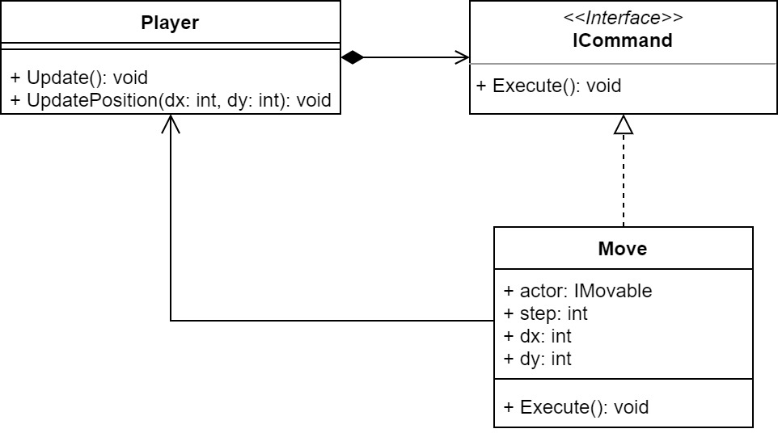

# Cvičenie 6: Hýbeme sa a upratujeme

Na minulom cvičení sme do našej hry pridali niekoľko rozšírení návrhového vzoru *Observer* ako aj hlavnú postavu. Na dnešnom cvičení si ukážeme ďalší návrhový vzor - *Command*. Ako už samotný názov naznačuje, návrhový vzor zabezpečuje spracovanie príkazov, ktoré zadajú naši používatelia, a aby interakcia bola intuitívna, pozrieme sa na to, ako dokážeme pracovať s používateľským vstupom. Konkrétne to použijeme na riešenie pohybu nášho hráča.

## 1. krok: Didst Thou Forget How to Moveth?

Ale ako sa hýbať?

Najjednoduchšie by bolo priamo do `Update()` implementovať čítanie klávesnice a upravovať takto pozíciu. Takéto riešenie je však nepraktické a zbytočne by skomplikovalo inak jednoduchú metódu. [Namiesto toho teda využijeme návrhový vzor *Command*, ktorý vynašli od nás múdrejší návrhári na riešenie presne takýchto problémov.](https://en.wikipedia.org/wiki/Command_pattern)



Zadefinujte interface `IMovable` (nech sa nachádza v namespaci `Actors`). Toto rozhranie v sebe nebude mať žiadnu funkcionalitu, jedná sa o tzv. *marker interface* - slúži len na odlíšenie tried. Nech `Player` implementuje rozhranie `IMovable`.

Vytvorte si priečinok `Commands` a pridajte do neho rozhranie `ICommand` s metódou `Execute()`:

```
public interface ICommand
{
    void Execute();
}
```

Jedná sa o základ návrhového vzoru, ktorý teraz postupne implementujeme.

### 1.1. `Move`

Do priečinku `Commands` pridajte triedu `Move` (implementuje `ICommand`).

Nech je konštruktor deklarovaný nasledovne: `public Move(IMovable movable, int step, int dx, int dy)`, kde `step` udáva rýchlosť pohybu a `dx` a `dy` udávajú smer pohybu pohybujúceho sa actora `movable`.

*Svet používa klasické indexovanie súradníc ako v poli, kde ľavý horný roh má [0,0], x-ová súradnica je vodorovná a rastie doprava, y-ová je zvislá a rastie smerom dole.*

**Poznámka:** V konštruktori nezabudnite vykonať typovú kontrolu, či ste dostali objekt, ktorý je aj `Player`. Ak by to neplatilo, program nesmie pokračovať - vyvolajte chybu (s vhodnou chybovou hláškou). Chybu v C# viete vygenerovať pomocou kľúčového slova [`throw`](https://learn.microsoft.com/en-us/dotnet/csharp/language-reference/keywords/throw):

```
throw new ArgumentException("error message goes here");
```

Ak chybu nikde v kóde neošetríme, spôsobí to, že program spadne - nadnes je to náš cieľ.

V `Execute()` zabezpečte zmenu pozície `IMovable` actora - využite metódu `UpdatePosition()` z triedy `Player`, objekt musíte najprv pretypovať.

### 1.2. `Player`

V triede `Player` si na vhodnom mieste (asi konštruktor) inicializujte pomocné objekty potrebné pre pohyb. Vytvorte osobitný objekt pre všetky štyri základné smery. Zabezpečte, aby sa v metóde `Update()` vykonalo čítanie z klávesnice a zodpovedajúci pohyb vykonajte pomocou návrhového vzoru *Command*. Využite teda novú triedu `Move`.

*Čítanie z klávesnice je dostupné cez triedu `KeyChecker`. Príklad použitia ste mali na minulom cvičení. Okrem `HasBeenPressed()` je dostupná aj metóda `IsPressed()`, vyskúšajte si ich, aký je medzi nimi rozdiel? Ktorá je vhodnejšia pre riešenie pohybu?*

*Klávesy sú vymenované v enumerácii `Microsoft.Xna.Framework.Input.Keys`, zatiaľ sú pre nás zaujímavé `Keys.Up / Down / Left / Right` - tieto mapujú šípky.*

V návrhovom vzore *Command* je každý pokyn reprezentovaný objektom, teda pri realizácii pohybu potrebujete vytvoriť objekt, ktorý predstavuje tento pohyb. Implementujte minimálne jeden smer pohybu a svoju implementáciu vyskúšajte. Nezabudnite si hráča pridať do hry. Následne implementujte ostatné smery pohybu obdobným štýlom a tiež nastavte animáciu podľa toho, či sa hráč pohybuje (zastavte animáciu) a v akom smere (otočte sprite).

Do vášho riešenia pridajte aj spúšťanie/zastavovanie animácie pri pohybe, ako aj správne otočenie ak sa hráč pohybuje doľava. Pri otáčaní vieme využiť vhodnú definíciu metódy `Draw()` (viac informácií nájdete v dokumentácii](https://docs.monogame.net/api/Microsoft.Xna.Framework.Graphics.SpriteBatch.html#Microsoft_Xna_Framework_Graphics_SpriteBatch_Draw_Microsoft_Xna_Framework_Graphics_Texture2D_Microsoft_Xna_Framework_Rectangle_System_Nullable_Microsoft_Xna_Framework_Rectangle__Microsoft_Xna_Framework_Color_System_Single_Microsoft_Xna_Framework_Vector2_Microsoft_Xna_Framework_Graphics_SpriteEffects_System_Single_):

```
public void Draw(Texture2D texture, Rectangle destinationRectangle, Rectangle? sourceRectangle, Color color, float rotation, Vector2 origin, SpriteEffects effects, float layerDepth)

// use SpriteEffects.FlipHorizontally or SpriteEffects.None
spriteBatch.Draw(texture, destinationRectangle, sourceRectangle, Color.White, 0f, new Vector2(0, 0), SpriteEffects.FlipHorizontally, 0f);
```

**Poznámka:** Aj keď v hre pracujeme s pohľadom z boku a reálne sa naša postava nebude pohybovať smerom hore a dole, tieto pohyby sa nám zídu pri definícii zložitejších konceptov ako je skok a gravitácia, ktoré nás čakajú na ďalšom cvičení.

S využitím *command* dokážeme zabezpečiť aj viaceré nezávislé pohyby ako aj ďalšie pokyny, napríklad vstup od používateľa a gravitáciu, prípadne odkopnutie atď.

**Poznámka:** Statický framerate pre lepšiu animáciu viete nastaviť v konštruktore `Game1` príkazom:

```
TargetElapsedTime = TimeSpan.FromSeconds(1d / 30d);  // second number is FPS
```

## Intermezzo

Po pridávaní niekoľkých tried, rozhraní a ďalších konceptov náš projekt pekne rozrastá, čo nám komplikuje život. Vidíme v riešení duplicitný kód a nepríjemnú prácu s objektmi, kde nestačí nám ich pridať do hry, ale musíme dbať aj na ich prípadnú aktualizáciu, vykreslenie a ďalšie záležitosti. Nebolo by jednoduchšie, keby nám náš projekt poskytol lepšiu podporu pre často sa opakujúce funkcionality?

Počítačové hry takúto funkcionalitu riešia v hernom engine, ktorý zabezpečuje presne tie časti funkcionality, ktoré sú spoločné pre väčšinu počítačových hier. V ďalšej časti cvičenia si vytvoríme náznak takéhoto jednoduchého enginu, pričom zjednodušíme aj naše triedy a implementáciu niektorých metód. Začneme menším upratovaním, následne použijeme ďalší návrhový vzor na generovanie objektov, a na záver prerobíme prácu so svetom našej hry.

## 2. krok: `AbstractActor`

Na poslednom cvičení sme si ukázali, ako dokážeme spoločnú funkcionalitu niekoľkých tried zapuzdriť do abstraktnej triedy, a tak predísť duplicitným kódom. Konkrétne sme to urobili pre triedy `LightBulb` a `PowerSwitch`, kde funkcionalitu zapájania sme presunuli do abstraktnej triedy `AbstractSwitchable`.

Ak sa ale pozriete na implementáciu všetkých tried, tak vidíte, že stále nám ostáva funkcionalita, ktorá je rovnaká, alebo skoro rovnaká pre všetky triedy, najmä čo sa týka vykresľovania, ale aj reprezentácie herných objektov.

Vytvorte si preto abstraktnú triedu `AbstractActor` v priečinku `Actors`. Vnútornú štruktúru navrhnite tak, aby vhodne podporovala funkcionalitu, môžete pritom vychádzať z existujúcej implementácie tried. Okrem doteraz použitých premenných pridáme aj premennú pre meno objektu, ktorá nám bude slúžiť pre nájdenie konkrétnych objektov v hernom svete počas behu.

Najprv si vytvorte rozhranie `IActor`, s predpísanými metódami (zatiaľ si vytvorte prázdne rozhranie `IWorld` a triedu `GameWorld`, ktorá toto rozhranie implementuje v novom priečinku `Worlds`):

```
string GetName();
void SetName(string name);
int GetX();
int GetY();
int GetHeight();
int GetWidth();
void SetPosition(int posX, int posY);
void OnAddedToWorld(IWorld world);
IWorld GetWorld();
Texture2D GetTexture();
void SetTexture(Texture2D texture);
bool IntersectsWithActor(IActor other);
void SetPhysics(bool isPhysicsEnabled);
bool IsAffectedByPhysics();
void RemoveFromWorld();
bool RemovedFromWorld();
void Update(GameTime gameTime);
void Draw(SpriteBatch spriteBatch);
```

Následne napíšte triedu `AbstractActor`, ktorá implementuje rozhranie `IActor` s nasledovnou funkcionalitou:

* konštruktor:

    * `AbstractActor()` - nastavte prázdny `string` pre meno postavy, nech sa predíde problémom. Môžete inicializovať aj ďalšie členské premenné defaultne podľa potreby.
    * `AbstractActor(string name)` - nastavte meno postavy podľa parametra.

* `string GetName()`, `void SetName(string name)` - riadia prístup k mene actora.
* `int GetX()`, `int GetY()` - vráti x-ovú a y-ovú súradnicu objektu (ľavý horný vrchol textúry).
* `int GetHeight()`, `int GetWidth()` - vráti rozmery actora (viete ich získať z textúry).
* `void SetPosition(int posX, int posY)` - nastaví pozíciu postavy.
* `void OnAddedToWorld(IWorld world)` - nastaví referenciu na svet, v ktorom sa actor pohybuje. V `AbstractActor` ostáva prázdna.
* `IWorld GetWorld()` - vracia referenciu na svet actora, do triedy pridajte príslušnú členskú premennú.
* `Texture2D GetTexture()`, `void SetTexture(Texture2D texture)` - umožňujú prístup k textúre actora.
* `bool IntersectsWithActor(IActor other)` - zistí kolíziu s iným actorom, ktorý dostane ako parameter. Aby došlo ku kolízii, stačí aby sa textúry prekrývali v jednom bode, pričom predpokladáme, že obidvaja actori majú tvar obdĺžnika (bounding box).
* `void SetPhysics(bool isPhysicsEnabled)`, `bool IsAffectedByPhysics()` - informácie o fyzike, ktorá ovplyvňuje postavu (napr. gravitácia). Na repezentáciu toho, či actora ovplyvňuje fyzika sveta, používajte `bool` členskú premennú.
* `void RemoveFromWorld()` - slúži na nastavenie príznaku, či daný actor má byť zo sveta odstránený. Všetci označení actori budú na konci iterácie v hernej slučke odstránení naraz. Na implementáciu tohto flagu používajte `bool` členskú premennú.
* `bool RemovedFromWorld()` - zistí, či daný actor bol označený na odstránenie zo sveta. Neskôr trieda `GameWorld` zavolá túto funkciu v rámci hernej slučky po zavolaní `Update()`.
* `void Update(GameTime gameTime)` - vytvorte prázdnu implementáciu.
* `void Draw(SpriteBatch spriteBatch)` - rieši jednoduché vykresľovanie textúry.

**Poznámka:** Pre reprezentáciu pozície naďalej môžete používať `Vector2`, alebo to môžete rozdeliť do dvoch celočíselných premenných.

Po definícii abstraktnej triedy si upravte triedy `Bomb`, `AbstractSwitchable` a `Player` tak, aby dedili od `AbstractActor`. Pri triede `Bomb` upravte aj volanie metódy `Draw` tak, aby ste bombu vykreslili na už známu pozíciu (použite teda jeden parameter ako v prípade ostatných tried, napríklad pre `Player`). Ak je to potrebné, aktualizujte aj triedy `PowerSwitch`, `LightBulb` a `CrackedLightBulb`. Rozšírte konštruktory tak, aby ste každému objektu vedeli priradiť meno.

Pri implementácii `Draw(SpriteBatch spriteBatch)` ste možno narazili na otázku, ktorú implementáciu máte definovať v abstraktnej triede: vykresľovanie statickej textúry, alebo animácie ako v prípade bomby alebo hráča?

Elegantné riešenie tohto problému je vytvorenie ďalšej abstraktnej triedy `AbstractAnimatedActor`, v ktorej implementujete vykresľovanie animovanej textúry tak, ako sme to robili doteraz. Samozrejme k tomu potrebujete vytvoriť aj ďalšie členské premenné. Následne nastavte triedy `Bomb` a `Player` ako podtriedy `AbstractAnimatedActor` (namiesto `AbstractActor`), a aktualizujte ich implementáciu podľa potreby.

**Poznámka:** Pri `AbstractAnimatedActor` odporúčame vypočítať rozmery jednej snímky z celkových rozmerov textúry a počtu snímok (na základe počtu riadkov a stĺpcov). Túto funkcionalitu viete vyriešiť napríklad pomocou konštruktora `AbstractAnimatedActor(string name, Texture2D texture, int rows, int columns)`, ktorý potom môžete volať v podtriedach. Nezabudnite potom aktualizovať aj metódy `GetHeight()` a `GetWidth()`, a príslušné hodnoty možno potrebujete prepočítať pri zmene textúry.

## 3. krok: Let's Build a Factory

Rozhranie tried sme už pomerne dobre ujednotili, čo nám umožní zjednodušiť spôsob vytvárania jednotlivých objektov. Tento krok zatiaľ sme robili v metóde `LoadContent()` v triede `Game1`, ale predstavte si, že do vašej hry chcete pridať niekoľko svetov resp. máp. V takomto prípade by bolo vhodnejšie vytváranie objektov riešiť cez načítanie základných údajov o mape a umiestnení objektov v nej. Ako prvý krok k takémuto riešeniu si teraz vytvoríme factory pre naše objekty.

Návrhové vzory [*Factory Method*](https://en.wikipedia.org/wiki/Factory_method_pattern) a [*Abstract Factory*](https://en.wikipedia.org/wiki/Abstract_factory_pattern) slúžia na automatické vytváranie objektov. Vytvorte si triedu `ActorFactory` v novom priečinku `Factories`, ktorá nech implementuje rozhranie `IFactory`. Rozhranie deklaruje iba jednu metódu:

```
IActor Create(ContentManager content, String actorType, String actorName, int x, int y);
```

Cieľom tejto triedy je automaticky vytvárať nové objekty podľa vstupných parametrov: vieme takto zabezpečiť vytvorenie a pridanie actorov načítaných z mapy. Trieda je príkladom návrhového vzoru *Factory Method*, kde definujete metódu `Create`. Táto metóda vytvorí a vracia konkrétneho actora, ktorého sama vytvorí na základe zadaných parametrov a takisto nastaví všetky potrebné atribúty.

Metóda definuje parametre očakávaný typ objektu, ďalší je jeho meno a následne sú uvedené jeho pozície. V metóde zatiaľ umožnite vytváranie objektov typu `Player`, `Bomb`, `PowerSwitch`, `LightBulb` a `CrackedLightBulb` na základe parametra `actorType`. Keďže všetky triedy, ktoré *Factory Method* vytvára, musia mať spoločný interface, môžeme na tomto mieste využiť polymorfizmus (návratový typ `IActor`). Pre ďalšie parametre konštruktorov tried si nastavte ľubovoľné predvolené hodnoty. `ContentManager` môžete nastaviť priamo ako členskú premennú factory.

Následne upravte implementáciu `LoadContents()` tak, aby nevolala priamo konštruktory jednotlivých tried ale využila factory.
