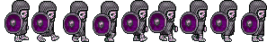

# Cvičenie 7: Gravitácia a ďalšie komplikácie

Na minulom cvičení sme do nášho projektu pridali niekoľko abstrakcií a tým sme zovšeobecnili riešenie tak, aby sme mohli pridávať ďalšie funkcionality. Na dnešnom cvičení konkrétne pridáme prirodzenejšiu interakciu s objektmi v hernom svete, zabránime tomu, aby sa niektorí aktori vznášali, urobíme poriadok v pohybe hráča, a pridáme aj nepriateľov.

## 1. krok: There are No Ghosts Here
Od štvrtého cvičenia už dokážeme v našej hre zapínať vypínač stlačením klávesu *E*, avšak od momentu, kedy sme pridali do hry hráča, je takéto riešenie dosť neprirodzené. Upravte teda svoje riešenie tak, aby sme vypínač vedeli zapínať iba v momente, ak sa ho hráč dotýka. K tomu možno potrebujete urobiť hneď niekoľko zmien...

### 1.1. krok: `OnAddedToWorld`
Aby ste mohli efektívne zisťovať dotyk aktorov, potrebujete zabezpečiť prístup k všetkým aktorom v hernom svete. Na tieto účely sme v triede `AbstractActor` pridali členskú premennú `world`, ako aj metódy `GetWorld()` a `OnAddedToWorld()`. Skontrolujte si teda, že túto premennú máte k dispozícii, a že vďaka metódam ju viete nastavovať, resp. získať jej hodnotu.

### 1.2. krok: `GameWorld`
Na minulom cvičení sme si už vytvorili jednoduchú implementáciu herného sveta v triede `GameWorld`, ktorá implementovala rozhranie `IWorld`, ktoré však ostalo prázdne. Tento nedostatok teraz napravíme, pridajte teda do rozhrania nasledovné deklarácie:

```
void AddActor(IActor actor);
void RemoveActor(IActor actor);
List<IActor> GetActors();
IActor? GetActor(string name);
void Draw(SpriteBatch spriteBatch);
void Update(GameTime gameTime);
int GetHeight();
int GetWidth();
```

Väčšina týchto metód bola už implementovaná v `GameWorld`, až na posledné dva gettery, ktoré majú vrátiť rozmery sveta (nemusia byť totožné s rozmermi okna). Upravte teda triedu `GameWorld` tak, aby implementovala túto funkcionalitu, pridajte potrebné členské premenné a definujte chýbajúce metódy.

### 1.3. krok: Let There Be Light
Po prípravných prácach teraz už viete upraviť implementáciu triedy `PowerSwitch` tak, aby sa vypínač dal zapnúť iba v prípade, ak sa ho hráč dotýka. Pri implementácii môžete rátať s tým, že hlavná postava hry bude mať vždy meno *Player*.

## 2. krok: Newton's Legacy

Píše sa rok 1687 a Sir Isaac Newton práve publikoval dielo, ktoré zmenilo svet, s názvom *Principia*. Zažite tento slávny moment a objavte gravitáciu!

### 2.1. krok: Aaaand `Action<T>`
Ako aj v predošlom kroku, aj teraz začneme implementáciu s prípravnými prácami. Najprv pridáme pomocnú triedu, ktorá bude zabezpečovať pád smerom k zemi pre vybraných aktorov. V priečinku *Commands* si vytvorte rozhranie `IAction`:

```
public interface IAction<T>
{
    public void Execute(T value);
}
```

Ako už deklarácia napovedá, jedná sa o niečo podobné ako `ICommand`, ale je tu jeden rozdiel - v rámci metódy `Execute` odovzdávame parameter. Tento vieme využiť pri našej implementácii pádu, kde už nebudeme potrebovať vytvárať stále nový objekt pre každého aktora ale použijeme stále ten istý. Keďže chceme, aby implementácia bola všeobecná, využijeme tu typový parameter `T`. To znamená, že síce vieme, že objekty `IAction` budú vždy pracovať s rovnakým typom objektov, nevieme zatiaľ, aký to bude konkrétny typ. Práve preto konkrétny typ nahradíme premennou `T`, ktorú naplníme hodnotou až pri volaní.

Pridajte si do *Commands* aj triedu `Fall`, nech implementuje `IAction`. Máme tu dva spôsoby definície (použite druhý):

```
public class Fall : IAction<IActor>
{
    public void Execute(IActor value)
    {
        //magic with actor
    }
}
```

```
public class Fall<T> : IAction<T> where T : IActor
{
    public void Execute(T value)
    {
        //magic with something, that implements IActor
    }
}
```

Druhý zápis určí, že `Fall` bude pracovať s objektmi všeobecného typu, vieme ale, že tento typ bude implementovať rozhranie `IActor` (`T : IActor`). Takýmto spôsobom sa vyhneme unboxingu a samozrejme aj zbytočnému vytváraniu množstva objektov, čo je hlavná výhoda návrhového vzoru *Action*. To však neznamená, že *Command* je zlý, ešte sa nám bude hodiť.

Implementujte v triede `Fall` pád. Pri implementácii môžete vychádzať z triedy `Move`, pričom viete, že `Fall` bude mať vždy rovnaké hodnoty kroku a smeru. Pri definícii metódy `Execute` zabezpečte to, aby aktor nikdy nepadal mimo herného sveta, teda svoj pád ukončí nejneskôr ak dosiahne spodok sveta (prekážky a steny pridáme neskôr).

### 2.2. krok: `IPhysics` a `Gravity`
Gravitácia je fyzikálny jav, podporu ktorých sme už pripravili v triede `GameWorld` aj `AbstractActor`, spomeňte si na metódy typu `IsAffectedByPhysics()`, resp. `SetPhysics()`. Teraz si vytvoríme triedu `Gravity`, ktorá bude reprezentovať základnú fyziku platnú v našej hre.

Najprv znova začneme definíciou rozhrania, tentokrát to bude `IPhysics` (naďalej pracujeme v priečinku *Commands*). Jedná sa o rozšírený `ICommand`, je tu navyše metóda `SetWorld`. Táto sa zavolá automaticky pri nastavení fyziky sveta a dostanete v nej referenciu na `IWorld`, v triedach implementujúcich rozhranie si ju uložíme, keďže ju budeme potrebovať.

```
public interface IPhysics : ICommand
{
    void SetWorld(IWorld world);
}
```

Následne implementujte triedu `Gravity`. Niekoľko poznámok:
* Každý actor implementuje 2 metódy - `bool IsAffectedByPhysics()` a `void SetPhysics(bool isPhysicsEnabled)` - pomocou nich dokážeme regulovať, či bude daný actor ovplyvnený fyzikou alebo nie - môžeme takto nechať nejaký predmet lietať vo vzduchu.
* `IWorld` má v sebe metódu `GetActors()` - táto vráti zoznam všetkých aktorov vo svete.
* Na pád využite `Fall`.
* V cykle, napríklad `foreach`, si implementujte pád, nezabudnite zohľadniť, či je daný predmet ovplyvnený gravitáciou.

### 2.3. krok: Falling Down
Teraz už konečne môžeme gravitáciu pridať do našej hry, k tomu potrebujete urobiť dve zmeny:

1. pridajte gravitáciu do triedy `GameWorld`, nezabudnite aktualizovať aj metódu `Update()`;
2. upravte hráča (a prípadne ďalšie triedy) tak, aby bol ovplyvnený fyzikou (využite metódu `void SetPhysics(bool isPhysicsEnabled)`).

Teraz si môžete skontrolovať vašu implementáciu, ak ste postupovali správne, tak hráč začne padať hneď na začiatku hry bez ohľadu na to, kde ho inicializujete. Zároveň pohyb hore pomocou šípky už nebude fungovať, keďže gravitácia tento pohyb zneguje. Pohyb dole je vyriešený tiež pádom, takže tieto dva smery môžete vymazať z implementácie.

## 3. krok: Might As Well Jump!
Síce pohyb hore sme už zrušili, náš hráč sa ale niekedy potrebuje dostať vyššie vo svete. Práve preto by bolo vhodné pridať možnosť skoku. Je na vás, ako túto funkcionalitu zabezpečíte, ale základný princíp je asi jasný:

* po stlačení niektorého klávesu (napríklad *Space*) hráč vyskočí;
* pri skákaní hráč postupuje smerom hore až kým nedosiahne maximálnu výšku skoku;
* následne začne padať.

Aby ste vedeli prekonať gravitáciu, tak potrebujete vypnúť fyziku pre hráča pri začatí skoku, a zase ju zapnúť pri dosiahnutí maximálnej výšky skoku. Takisto môžete pridať funkcionalitu, že ak hráč narazí do niečoho, tak jeho skok končí. Výška skoku musí byť konečná v každom prípade. V prípade záujmu (a/alebo nudy) môžete implementovať aj dvojskok.

## 4. krok: My Very Own Enemy

Pre reprezentáciu protivníka vytvorte triedu `Enemy` (rozširuje `AbstractAnimatedActor`), ako animáciu použite napríklad [`enemy.png`](lab07/enemy.png).



V `Update` implementujte funkcionalitu, že ak sa hráč k nepriateľovi priblíži na vzdialenosť *n* pixelov, začne ho prenasledovať. Pokiaľ je obeť v nedohľadne, nech sa nepriateľ náhodne prechádza po mape. Môžete sa inšpirovať triedou `Player`. Náhodnosť viete zabezpečiť nasledovným spôsobom:

```
Random random = new Random(); //initialize pseudorandom number generator, do this only once

//some awesome code...

int x = random.Next(min, max); //get random number from the given range
```
