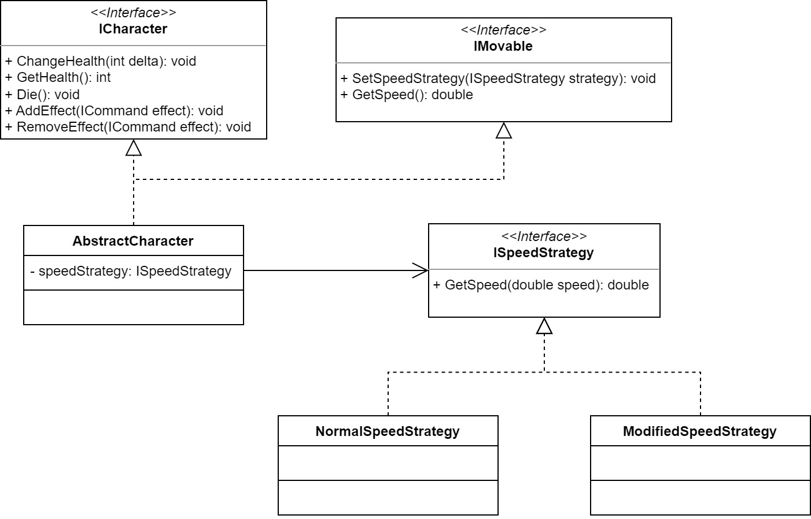

# Cvičenie 8: Stratégie

Na tomto cvičení rozšírime niektorých actorov o stratégiu pohybu pomocou ďalšieho návrhového vzoru. `Player` a `Enemy` zatiaľ majú spoločné rozhranie triedy cez `AbstractActor`, majú však aj špeciálne vlastnosti, ktoré ich odlišujú od ostatných aktorov. Na rozdiel od predmetov (bomba, vypínač, žiarovka) sa totiž hýbu a okrem toho by v ozajstnej hre podobné postavy mali aj život.

## 1. krok: Gimme a Plan

Vytvorte si rozhranie `ISpeedStrategy` (v novom priečinku *Strategies*), ktoré deklaruje jednu metódu: `double GetSpeed(double speed)`. Následne si vytvorte triedy `NormalSpeedStrategy` a `ModifiedSpeedStrategy` ktoré toto rozhranie implementujú. Tieto triedy nech slúžia na získanie aktuálnej rýchlosti postavy, pričom pôvodnú rýchlosť dostanú ako parameter. `NormalSpeedStrategy` nech vráti túto hodnotu, kým v `ModifiedSpeedStrategy` si môžete implementovať akúkoľvek inú stratégiu (napr. postavu zrýchlite, resp. spomaľte).

Tieto komponenty budú kostrou [návrhového vzoru *strategy*](https://en.wikipedia.org/wiki/Strategy_pattern), ktorý je jeden z behaviorálnych návrhových vzorov. Využíva sa v prípade, keď v čase písania kódu ešte nevieme, pomocou akého algoritmu bude niektorá časť funkcionality implementovaná, resp. počas behu programu sa môže meniť konkrétna implementácia, ktorú chceme použiť.



Základná štruktúra návrhového vzoru spočíva v spoločnom rozhraní (v našom prípade `ISpeedStrategy`) rôznych tried, ktoré implementujú takzvané stratégie (`NormalSpeedStrategy` a `ModifiedSpeedStrategy`). Následne triedu, ktorá bude využívať naše stratégie (postavy, implementujeme neskôr), rozšírime o členskú premennú stratégie (typu `ISpeedStrategy`) a takto budeme môcť využívať metódy definované v tomto spoločnom rozhraní (`GetSpeed()`).

## 2. krok: Character

K implementácii celého návrhového vzoru už nám chýba len úprava postáv. Je však jasné, že všetky postavy budú mať niečo spoločné v tom, ako riešia pohyb, a práve preto tútu funkcionalitu vieme dať do spoločnej nadtriedy. Vytvorte si teda rozhranie `ICharacter` (v priečinku *Actors*), ktoré nech rozširuje `IMovable`. Vytvorte si aj abstraktnú triedu `AbstractCharacter`, ktorá bude implementovať rozhrania `ICharacter` a `IMovable` (priamo alebo nepriamo) a samozrejme bude rozširovať `AbstractAnimatedActor`.

Nech rozhranie `ICharacter` deklaruje nasledujúce metódy:

```
void ChangeHealth(int delta);
int GetHealth();
void Die();
void AddEffect(ICommand effect);
void RemoveEffect(ICommand effect);
```

kde *effect* reprezentuje veci, ako napríklad periodické dopĺňanie života / many, DoT efekty, spomalenie, zrýchlenie a pod. Efekty budú uložené v zozname a budú vykonané počas `Update()`, konkrétne typy efektov vytvoríte pri implementácii kúziel na ďalšom cvičení.

Metódy `ChangeHealth` a `GetHealth` pridávajú podporu života postavy, konkrétnu aktualizáciu života riešite už podľa vašich predstáv. V metóde `Die()` zatiaľ len označte postavu na vymazanie zo sveta (funkcionalita v `AbstractActor`). Nezabudnite si metódu automaticky zavolať, ak život postavy dosiahne 0.

## 3. krok: I'm Moving (A Bit Differently)

Do existujúceho rozhrania `IMovable` pridajte nasledujúce metódy:

```
void SetSpeedStrategy(ISpeedStrategy strategy);
double GetSpeed();
double GetBaseSpeed();
```

Následne musíte tieto metódy implementovať minimálne v `AbstractCharacter`.

Triedu `Move` upravte tak, aby pracovala s desatinnými číslami. Rýchlosť sa už nebude udávať v konštruktore, ale bude pýtaný od `IMovable` objektu. Keďže pozícia actora musí byť celé číslo, zabezpečte, aby sa rozdiel akumuloval a následne pripočítal keď dosiahne 1.

Pre jednoduchosť práce s animáciami si pridajte `enum ActorOrientation`, ktorý bude obsahovať dve hodnoty: `FacingLeft` a `FacingRight`. Využite ho na určenie orientácie actora vo svete. Niečo podobné už môžete mať vyriešené cez používanie logických hodnôt, enumerácia je však vhodnejší a prirodzenejší spôsob pre programátorov (v pozadí ale funguje úplne rovnako, ako booleovské hodnoty).

Vďaka modulárneho riešenia a vzájomného prepojenia tried pád a gravitáciu nemusíte upravovať.

## 4. krok: Tying It All Together

Obidve triedy `SpeedStrategy` implementujte tak, aby používali návrhový vzor *strategy* a tiež modifikujte `AbstractCharacter` tak, aby využíval spomínané triedy na získanie aktuálnej rýchlosti hráča: v `GetSpeed` sa odovzdáva pôvodná rýchlosť postavy, a stratégia vráti aktuálnu rýchlosť (napríklad ak postava je zranená, musí ísť pomalšie). Konkrétne fungovanie tried `NormalSpeedStrategy` a `ModifiedSpeedStrategy` je na vás.

Upravte triedy `Player` a `Enemy` tak, aby rozširovali `AbstractCharacter`, v prípade potreby urobte ďalšie zmeny v týchto triedach, aby ste mohli otestovať funkcionalitu stratégie, rôzne stratégie zatiaľ nastavte len pri spustení v konštruktore jednotlivých tried.

## 5. krok: A World Full of Obstacles and Opportunities

Do hry pridajte objekty, ktorých ak sa hráč dotkne, tak zmenia jeho rýchlosť (stratégiu), resp. život (napríklad ho zrania). Pre zmenu rýchlosti môžete použiť [sprite hviezdy](lab08/star.png), ktorý sme do hry pridali hneď na začiatku vývoja, pre objekt, ktorý zraní hráča, môžete použiť [klin](lab08/spike.png).


Funkcionalita je na vás, napríklad hviezda môže hráča zrýchliť, a klin nech ho zraní. V oboch prípadoch zabezpečte, aby po dotyku sa hviezda resp. klin hneď zmizli zo sveta. Nové triedy pridajte do nového priečinka *Items* (stále však môžu dediť od `AbstractActor`). Aby ste nové objekty vedeli pridať do sveta, potrebujete aktualizovať aj factory.
